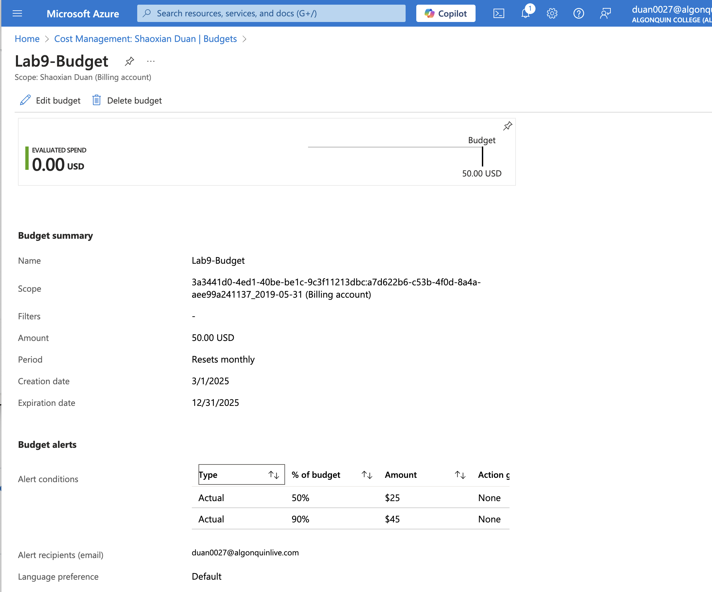

# Budgets and Alerts Configuration in Azure

## Overview
This document outlines the creation of a $50 monthly budget in Azure with usage alerts.

## Budget Setup
- **Budget Name**: Lab9-Budget
- **Amount**: $50/month
- **Scope**: Shaoxian Duan (Billing account)
- **Time Period**: Monthly, resets on 3/1/2025
- **Expiration Date**: 12/31/2025

## Alerts Configuration
- **50% Threshold**:
  - Alert at: $25
  - Notification: Email to duan0027@algonquinlive.com
- **90% Threshold**:
  - Alert at: $45
  - Notification: Email to duan0027@algonquinlive.com

## Instructions
1. Navigated to "Cost Management + Billing" in Azure Portal.
2. Created budget with $50 limit.
3. Set alerts at 50% ($25) and 90% ($45) usage.

