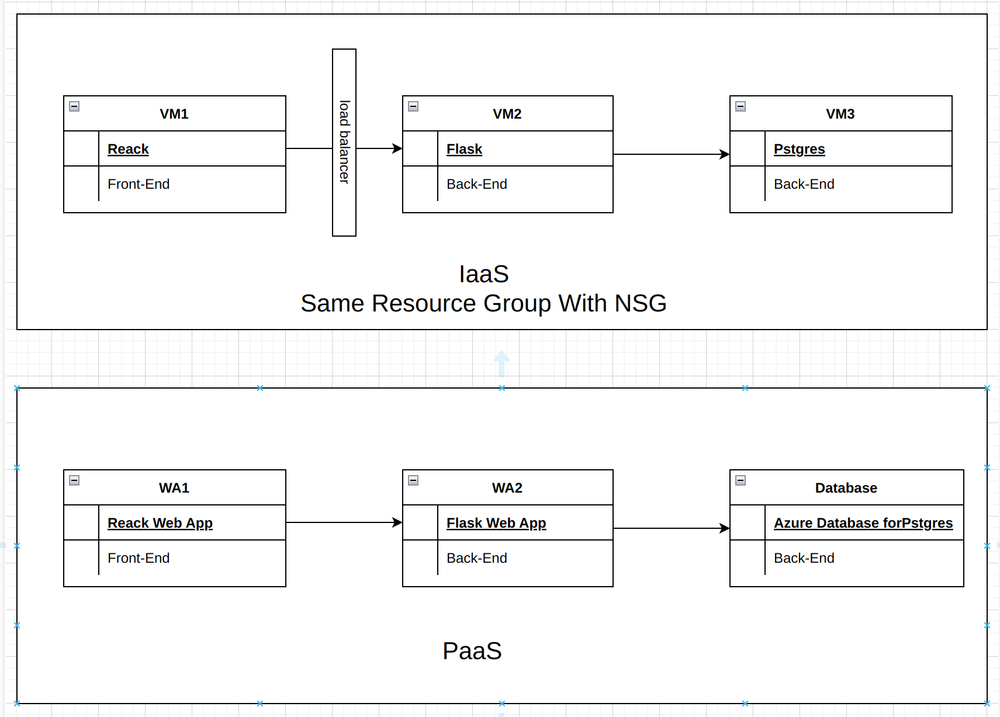

Lab 2 - IaaS/PaaS architecture
Student Name: Shaoxian Duan
Student Number: 041123100
1. Describe how this application can be deployed in the cloud using IaaS infrastructure
Answer:Step 1:Using IaaS, we need to create three Virtual Machines (VMs) on Azure:
·	The first VM will host the React front-end environment.
·	The second VM will run Flask, handling back-end API functions.
·	The third VM will run PostgreSQL, responsible for storing user data.
Step 2:Create an Azure Load Balancer to distribute incoming requests between the React front-end and the Flask back-end.
Step 3:Set up an Azure Resource Group and include all three VMs within it. Additionally, configure Network Security Groups (NSG) to control traffic and ensure secure communication between the VMs.
When choosing IaaS, we need to configure fundamental infrastructure such as network load balancing and security.
2. Describe how this application can be deployed in the cloud using PaaS infrastructure
Answer:Step 1:Using PaaS, we need to create three Web Apps on Azure:
·	A React Web App for the front-end.
·	A Flask Web App for the back-end.
·	An Azure Database for PostgreSQL to store and manage application data. The Flask back-end will connect to this database.
Step 2:Once the web apps are deployed, we need to configure Azure Monitor, specifically using Application Insights to monitor Flask API requests and ensure application health and performance tracking.
When using PaaS, we don't need to configure security and other plugins; Azure takes care of it.
3. Diagram

