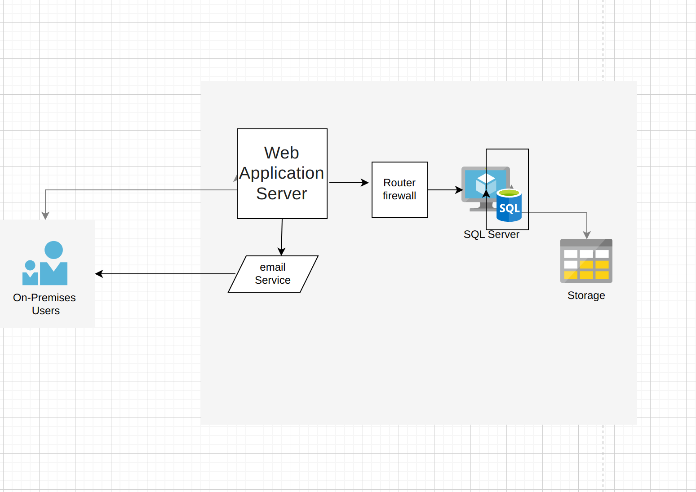
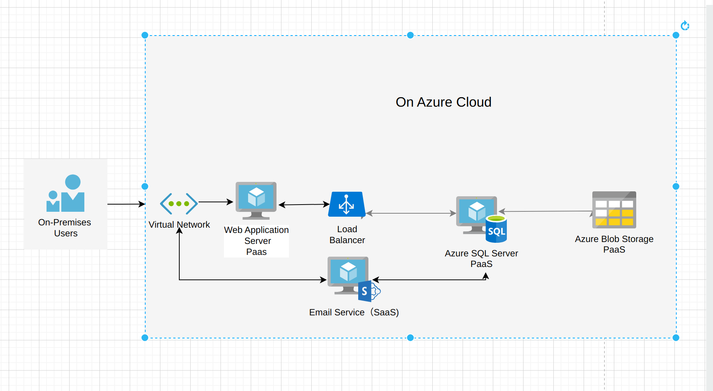

Section 1: On-Premises Solution Design

Current On-Premises Architecture
The current architecture of the retail company includes the following components:

Web Application Server:
A monolithic application hosted on an on-premises physical or virtual server. It handles user interactions and business logic.

SQL Server:
A dedicated database server used to store structured data, including customer information, inventory, and transactions.

Storage:
A local file system used for storing unstructured data such as images and reports.

Router/Firewall:
On-premises network devices ensuring secure communication and network management.
Email Service:

A local solution for sending client notifications, such as order confirmations.
On-Premises Users:

Internal users access the application via a local network.

Section 2: Migration Strategies

Migration Plan

1. Web Application Server
Migration Target: PaaS
Service Example: Azure App Services, AWS Elastic Beanstalk, or Google App Engine.
Reason: Moving the web application to a PaaS platform reduces infrastructure management overhead, provides automatic scaling, and integrates easily with cloud-based services. Refactoring the application into a cloud-native design will enhance scalability and performance.

2. SQL Server
Migration Target: PaaS
Service Example: Azure SQL Database.
Reason: Migrating the database to a managed PaaS solution offloads database management tasks such as backups, updates, and high availability. It also allows for seamless integration with other cloud services.

3. Storage
Migration Target: PaaS
Service Example: Azure Blob Storage, 
Reason: Cloud-based storage solutions offer cost-efficient, scalable, and secure storage for unstructured data.

4. Router/Firewall (Networking)
Migration Target: Virtual Network
Service Example: Azure Virtual Network,
Reason: Implementing virtual networking in the cloud ensures secure, isolated, and scalable networking. It allows for better integration of cloud services and provides advanced security features.

5. Email Service
Migration Target: SaaS
Service Example: Microsoft 365,
Reason: Migrating to a SaaS email solution simplifies email management while providing robust features like reliability, scalability, and compliance.

Migration Steps and Decisions
1. Web Application Migration
Objective: Refactor and migrate the monolithic web application to PaaS.
Steps:
Review application dependencies, frameworks, and codebase.
Ensure compatibility with the PaaS platform.
Refactoring:
Make minimal changes to decouple hard dependencies (e.g., logging, file paths).
Optimize the code to suit cloud-native environments.
Deployment:
Deploy the Web Application to the selected PaaS platform (e.g., Azure App Services or AWS Elastic Beanstalk).
Validate the deployment in a testing environment.
Configuration:
Set up environment variables and connection strings for databases and storage.
Configure auto-scaling and monitoring tools.
Validation:
Perform load testing to ensure scalability and reliability of the application.
Validate performance and functionality.

2. Database Migration
Objective: Perform a Lift-and-Shift migration of the database to IaaS, with plans to transition to PaaS later.
Steps:
Review current SQL Server configurations .
Ensure compatibility with the IaaS platform.
Preparation:
Create a backup of the on-premises SQL Server database.
Set up a similar SQL Server environment on the target IaaS virtual machine.
Lift-and-Shift Migration:
Restore the database backup on the cloud IaaS virtual machine.
Configure database access and test connectivity with the PaaS Web Application.
Validation:
Perform data integrity checks to ensure a successful migration.
Monitor database performance in the testing environment.

3. Storage Migration
Objective: Migrate unstructured data to cloud storage.
Steps:
Determine storage requirements, including file types and sizes.
Migration:
Transfer files to cloud storage services (e.g., Azure Blob Storage or AWS S3).
Integration:
Update Web Application code to integrate with the cloud storage API.
Validation:
Validate file accessibility and test application integration.

4. Networking and Security
Objective: Build a secure and efficient cloud-native network architecture.
Steps:
Virtual Network Setup:
Configure a Virtual Network to connect the Web Application, Database, and Storage.
VPN Gateway:
Set up a VPN Gateway for secure communication with on-premises systems during migration.
Firewall Rules:
Configure firewall rules to control inbound and outbound traffic.
Monitoring:
Enable logging and monitoring for network traffic.

5. Database Transition from IaaS to PaaS
Objective: After stabilizing the database on IaaS, migrate it to a managed database service (PaaS).
Steps:
Assessment:
Ensure database compatibility with the PaaS platform.
Planning:
Develop a migration plan, including downtime requirements and a switchover strategy.
Testing:
Validate database migration in a testing environment.
Migration:
Use tools like Azure Database Migration Service to migrate the database to PaaS.
Validation:
Perform post-migration testing to ensure data integrity and application functionality.

Migration Phase Table
Phase	 Tasks	                                                                    Estimated Time
Phase 1: Preparation Assess Web Application, Database, and Storage requirements	    3 weeks
Phase 2: Web Application Migration	Refactor and deploy to PaaS	                    3 weeks
Phase 3: Database Migration (IaaS)	Lift-and-Shift database to IaaS	                2 weeks
Phase 4: Storage Migration	Migrate unstructured data to cloud storage	            1 week
Phase 5: Database Migration (PaaS)	Transition database from IaaS to PaaS	        2 weeks