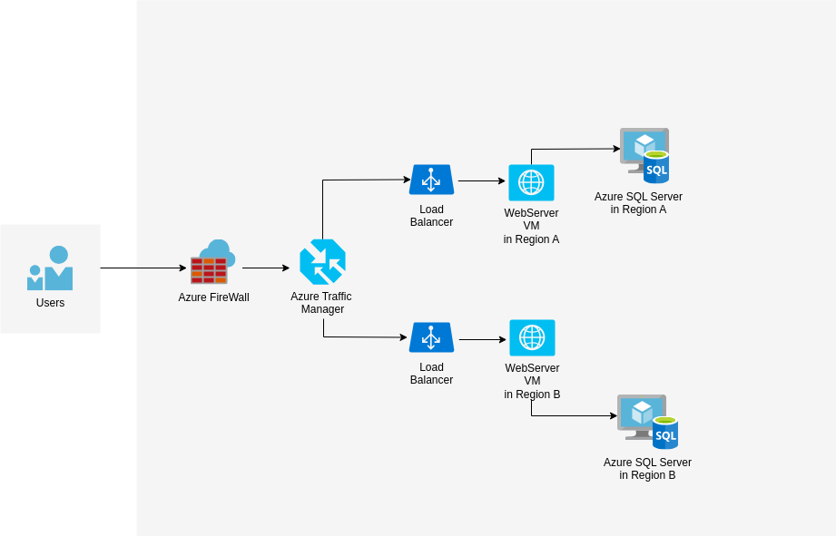

Student Name: shaoxian duan
Student number: 041123100
Lab4
Multi-Region Deployment with Load Balancing on Azure

1. Solution Diagram

2. Target Architecture Description
The proposed architecture ensures high availability and minimal downtime by leveraging a multi-region deployment strategy with automatic failover and Azure Load Balancer:
Front End: WebServerVM
·	Hosted in multiple Azure regions using Azure Virtual Machines.
·	Load-balanced across regions using an Azure Traffic Manager.
·	If one region fails, traffic is redirected to another active region.
Back End: Azure SQLVM:
·	database replicated across regions using Azure SQL Database with Geo-Replication(configration when we creating it )
·	Primary Azure SQLServer VM in Region A and Secondary Azure SQLServer VM in Region B.
Automated failover use Azure SQL Failover Group，Primary in Region A promotes Secondary in Region B if failure occurs。
·	Synchronization use Geo-Replication when we creating it to minimize performance impact.
Azure Traffic Manager distributes incoming traffic between regional web servers.
Load Balancing: after the Azure Traffic Manager , connect to load balancing, to guide the route map the workflow where should go. If a WebServerVM in one region becomes unresponsive, requests are routed to the healthy region.
3. Migration Steps
Step 1: Migration Assessment (pre migration)
Step 2: Replication of Virtual Machines Across Azure Regions
Step 3: Configuration of Load Balancers
Step 4: Implementation of Database Replication and Failover
Step 5: Migration Testing
Conclusion
This architecture ensures high availability by replicating web and database layers across Azure regions. Azure Traffic Manager handles traffic redirection, and Azure SQL Failover Group reduces downtime. Migration downtime will stay within the 6-hour limit.

