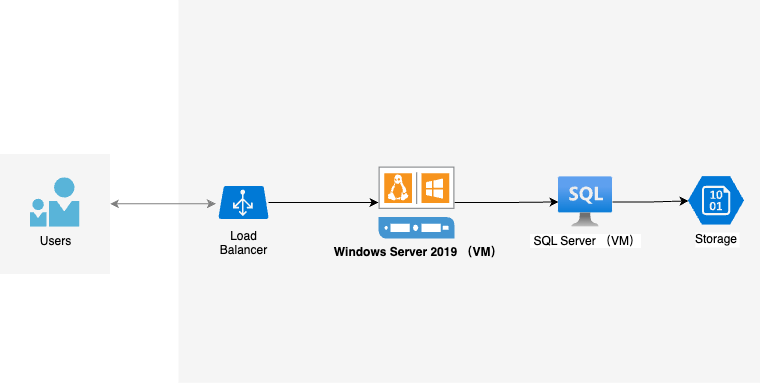
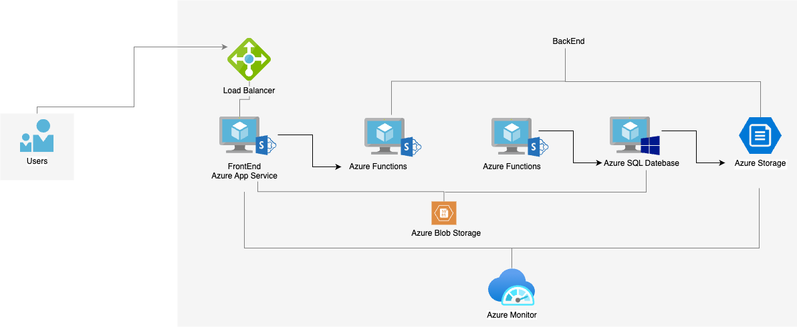

# Modernizing Azure Cloud Migration

## Original Architecture & Challenges (With Diagram)

Initially, the application followed a typical monolithic architecture where all functionalities were hosted on a single Windows Server 2019 virtual machine (VM). This VM handled the web application, business logic, and SQL Server database.

### **Key Challenges:**
- **Limited Scalability** - Scaling up required vertical scaling of the VM, which was costly and inefficient.
- **Reliability Issues** - The VM was a single point of failure; any crashes or downtimes would make the entire application unavailable.
- **High Maintenance Complexity** - Manually managing the operating system, database, and web application was time-consuming.
- **Inefficient Storage Management** - Static files and logs were stored on local disks, increasing storage costs and reducing flexibility.

## Refactored Architecture (With Diagram)

To address these challenges, we transitioned to a cloud-native architecture based on Azure, breaking down the monolithic application into multiple scalable services.

### **Key Improvements:**
- **Frontend migrated to Azure App Service** - Replaced VM-hosted web app, enabling auto-scaling.
- **Business logic moved to Azure Functions** - Serverless computing improved flexibility and maintainability.
- **Database migrated to Azure SQL Database** - Provides high availability and automated backups.
- **Storage moved to Azure Blob Storage** - Handles static files and logs efficiently while lowering costs.
- **Monitoring & Optimization** - Integrated Azure Monitor for log tracking and performance optimization.

## **Why We Chose These Azure Services**

### **Azure App Service:**
- Eliminates server management and supports auto-scaling.
- Built-in CI/CD integration simplifies deployments.

### **Azure Functions:**
- Event-driven compute scales as needed, reducing costs.
- Ideal for background tasks and API processing.

### **Azure SQL Database:**
- Fully managed database with high availability and automated backups.
- Intelligent performance optimization reduces maintenance overhead.

### **Azure Blob Storage:**
- Cost-effective storage for static assets and logs.
- Enhances storage flexibility and scalability.

### **Azure Monitor:**
- Provides application monitoring, log analysis, and automated alerts.
- Enhances observability and proactive issue detection.

## **Migration & Deployment Steps**

### **1. Database Migration**
- Backup the original SQL Server database.
- Use Azure Database Migration Service (DMS) to migrate to Azure SQL Database.

### **2. Frontend Migration**
- Deploy the web application to Azure App Service.
- Configure CI/CD pipelines for automated deployment.

### **3. Backend Refactoring**
- Identify backend tasks and convert them into Azure Functions.
- Configure triggers and bindings to optimize execution.

### **4. Storage Optimization**
- Move static resources and logs to Azure Blob Storage.
- Update application code to integrate with the new storage solution.

### **5. Monitoring & Optimization**
- Enable Azure Monitor to track application health.
- Configure auto-scaling strategies for optimized performance and cost.

## **Lessons Learned & Challenges Faced**

### **Challenges Encountered:**
- **Database Compatibility Issues** - Adjustments to SQL syntax were required for Azure SQL Database.
- **Serverless Architecture Adaptation** - Learning Azure Functions’ triggers and bindings took time.
- **Auto-Scaling Strategy Optimization** - Needed fine-tuning based on traffic patterns.

### **Key Takeaways:**
- **Breaking down the monolithic architecture was crucial** - Microservices improved scalability and flexibility.
- **Managed services reduced operational burden** - PaaS solutions simplified infrastructure management.
- **Automation enhanced deployment efficiency** - CI/CD streamlined iteration and releases.

## **Code & Deployment Guide**

The complete code and configuration files are hosted on GitHub: [[GitHub Repository Link](https://github.com/shaoxian423/CST8913/tree/main/Lab6)]
